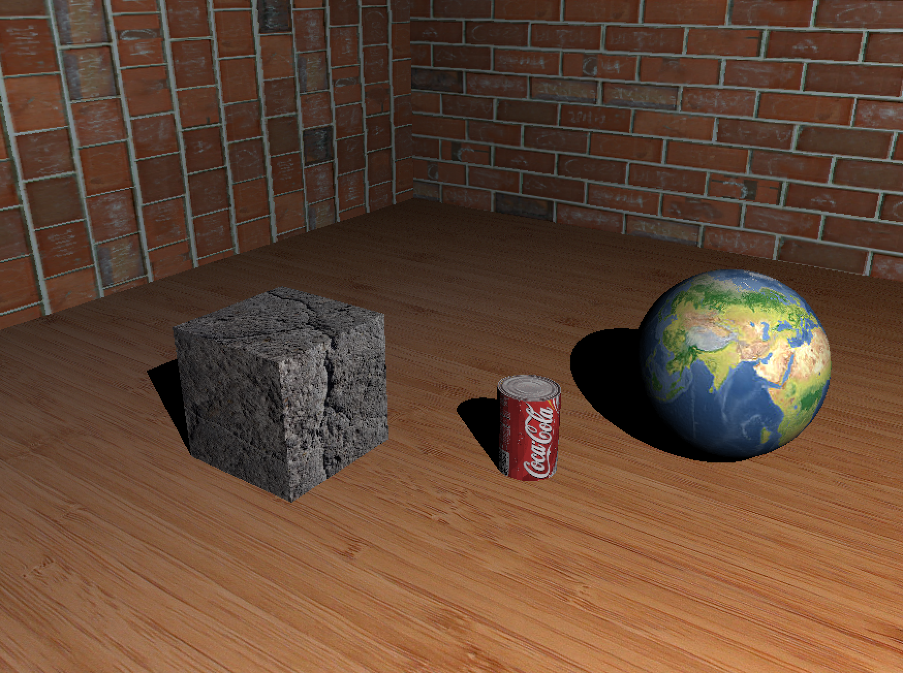
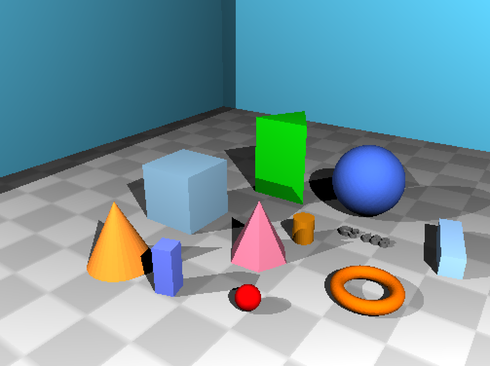
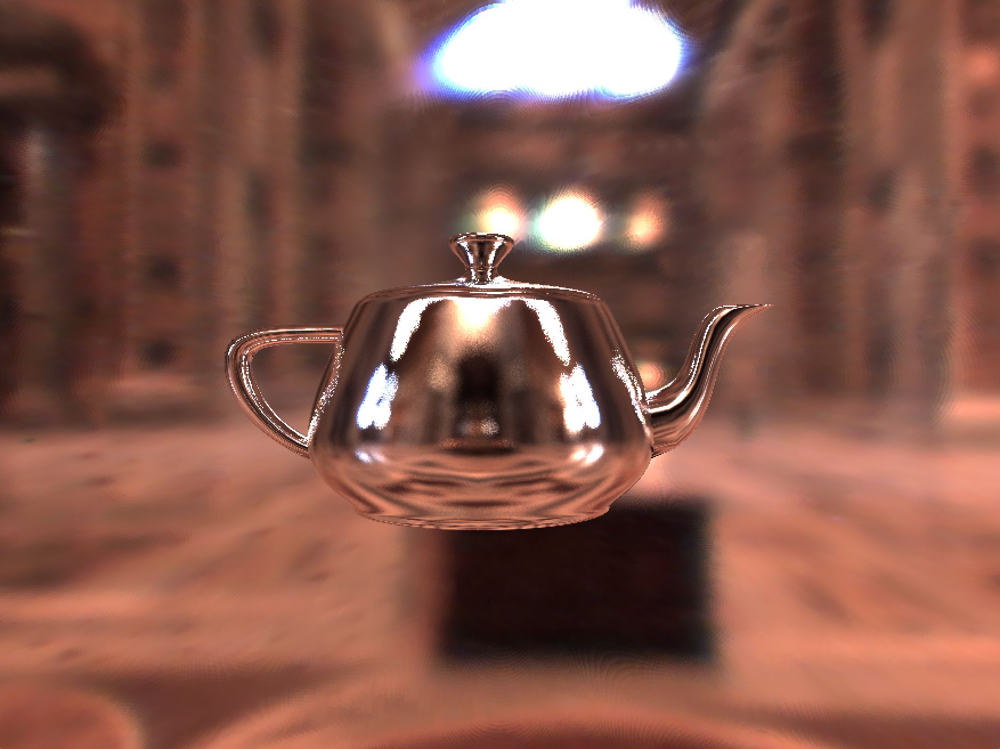
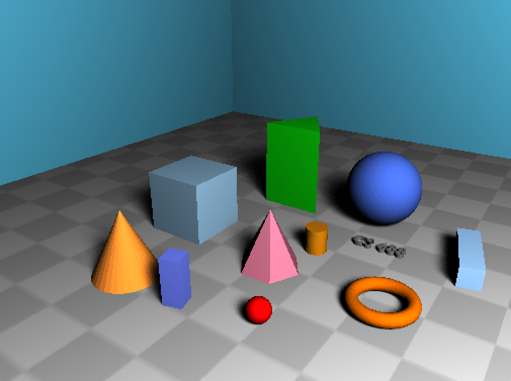
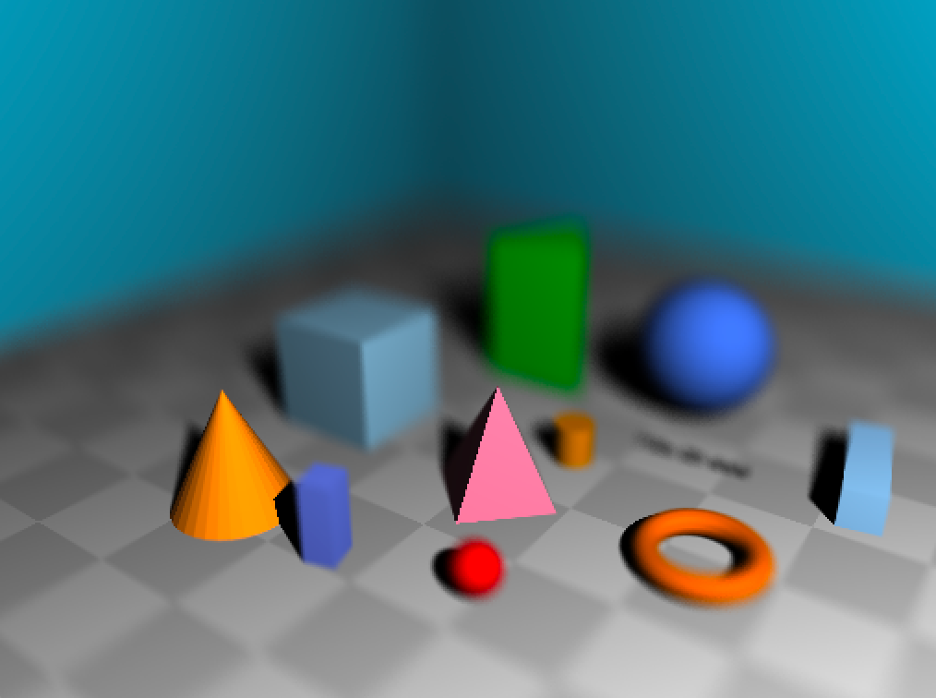

# A ray tracer that supports
* ray-geometry intersection
* shading
* shadow(hard and soft) casting
* reflections(mirror and glossy) and refractions
* environment mapping, texture mapping and bump mapping
* physical animations
* depth of field.

# [Github link](https://github.com/zguo14/Ray-Tracer)

# Example scene

# Texture mapping

# Multiple light souces

# Reflection

# Shadow

# Depth of field
