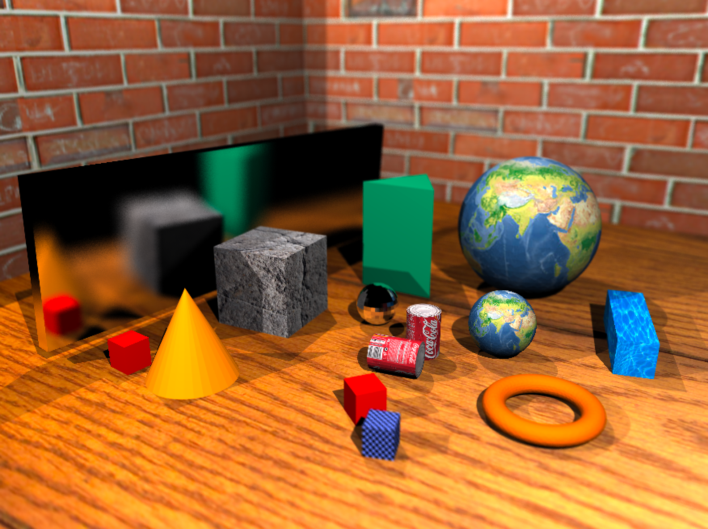

theme: leap day
# Ray tracer
A ray tracer that supports: ray-geometry intersection, shading, shadow(hard and soft) casting, reflections(mirror and glossy), refractions,
environment mapping, texture mapping, physical animations, and depth of field.
# How to run
* Use ./ray_tracer <example.obj> to load the scene.
# Example

