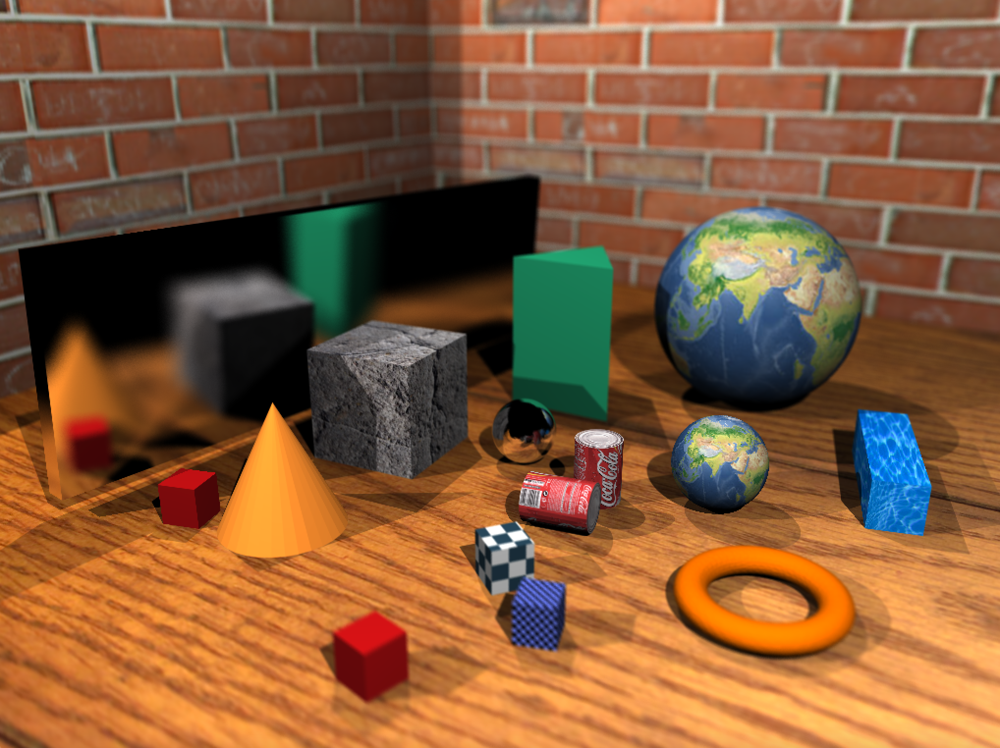

# Ray tracer
A ray tracer that supports: ray-geometry intersection, shading, shadow(hard and soft) casting, reflections(mirror and glossy), refractions,
environment mapping, texture mapping, physical animations, and depth of field.
# Github link:
* [Visit GitHub!](https://github.com/zguo14/Ray-Tracer)
# Example

